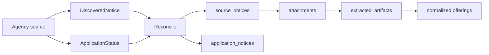

# Discovery v2 Phase 2: SH/LH Common Model

## 목적

SH와 LH/MyHome은 수집 경로가 다르지만 serving/API로 가기 전에는 같은 정제 파이프라인으로 수렴해야 한다. Phase 2의 Discovery 모델은 원문 공고 발견, 신청 상태 발견, 원문-상태 reconcile을 공통 개념으로 분리하고, 기관별 구현은 하위 패키지에 둔다.

## 패키지 경계

```text
pkg/discovery
pkg/discovery/sh
pkg/discovery/lh
```

- `pkg/discovery`: 공통 타입과 board-style notice discovery 계약.
- `pkg/discovery/sh`: SH 게시판, SH 인터넷청약 appUser 상태, SH reconcile.
- `pkg/discovery/lh`: LH/MyHome OpenAPI, LH 공고 상태, LH reconcile.

기존 `pkg/discovery/myhome*.go`는 Phase 2에서 `pkg/discovery/lh`로 이동하거나 compatibility wrapper만 남긴다.

## 공통 타입 초안

```go
type DiscoveredNotice struct {
	Agency      string
	Source      string
	BoardKind   string
	SourceSeq   string
	Title       string
	PostedAt    time.Time
	DetailURL   string
	Attachments []AttachmentMeta
	RawMetadata map[string]any
}

type ApplicationStatus struct {
	Agency            string
	Source            string
	ExternalCode      string
	SupplyType        string
	RecruitType       string
	Title             string
	Status            string
	SupplyCount       *int
	PostedAt          time.Time
	ApplicationURL     string
	RawMetadata       map[string]any
}

type DiscoverySource interface {
	ListNotices(ctx context.Context, opts NoticeOptions) ([]DiscoveredNotice, error)
}

type ApplicationStatusSource interface {
	ListApplicationStatuses(ctx context.Context, opts StatusOptions) ([]ApplicationStatus, error)
}
```

## 데이터 흐름



## 기관별 적용

SH:
- `pkg/discovery/sh`가 게시판 원문과 appUser 상태를 분리 수집한다.
- appUser `청약중`/`접수예정`은 board scan target으로 사용한다.
- `application_notices.notice_id`로 원문 공고와 연결한다.

LH:
- `pkg/discovery/lh`가 MyHome 공고 API를 독립 수집한다.
- MyHome 응답의 공급기관, 공급유형, 신청기간, 주소, 단지명, 공급호수, 보증금, 월임대료는 normalize 단계로 넘긴다.
- MyHome 자체가 상태/공고 메타를 함께 제공하면 `ApplicationStatus`와 `DiscoveredNotice`를 같은 external code로 reconcile한다.

## 검증 기준

- SH: `splyTy=12`, `recrnotiCd=202620092`가 `source_notices.seq=303584`와 연결된다.
- LH: MyHome 임대 공고 하나가 `source_notices`, `extracted_artifacts`, `offerings`, `notice_schedules`로 저장된다.
- 두 기관 모두 serving 기본 노출은 QA-approved offerings만 대상으로 한다.
- DB 통합 테스트는 테스트마다 독립 DB를 만들고 종료 시 drop한다.

