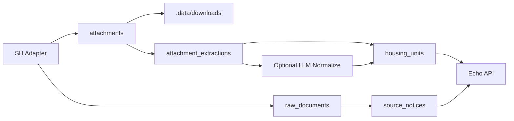

# SH Data 아키텍처 결정

작성일: 2026-05-13

## 선택한 방향

Adapter + Raw Store + Deterministic Parser + Optional LLM Normalize 구조로 간다.

LLM은 1차 수집의 필수 요소로 두지 않는다. 먼저 원문 HTML/JSON/첨부 파일/첨부 추출 결과를 손실 없이 저장하고, 결정론적 파서로 필드를 채운다. LLM은 PDF/HWP의 표 추출 품질이 낮거나 공고별 표현이 흔들릴 때 후처리 검증자 또는 보강자로 사용한다.

## 구성

## 저장 원칙

- 원본 HTML/JSON은 `raw_documents`에 저장한다.
- 공고 목록/상세 파싱 결과는 `source_notices`에 저장한다.
- 첨부 메타와 원본 파일 경로는 `attachments`에 저장한다.
- PDF 미리보기 HTML, XLSX 전체 행, 추출 오류는 `attachment_extractions`에 저장한다.
- 호수 단위 후보는 `housing_units`에 저장한다.
- 정규화가 틀릴 수 있는 값은 원본 JSONB를 함께 둔다.

## DB 테이블

- `collection_runs`: 수집 실행 이력과 통계
- `raw_documents`: HTML/JSON 원문
- `source_notices`: 공고/알림 단위 정규화
- `attachments`: 첨부 메타, 다운로드 URL, 저장 경로, 해시
- `attachment_extractions`: 첨부 추출 결과
- `housing_units`: 개별 호수/공급 타입 후보 데이터

## LLM 사용 판단

SH/LH의 HTML 목록과 첨부 메타는 LLM 없이 처리하는 편이 안정적이다. LLM이 유용한 지점은 다음이다.

- PDF/HWP 본문에서 표가 깨져 나온 경우 행/열 복원
- “보증금/임대료/면적/공급호수” 같은 필드명이 공고마다 다른 경우 의미 매핑
- 공고 본문에서 신청자격, 일정, 지역, 공급 유형을 구조화할 때
- 파서 결과의 confidence가 낮은 후보 행 검수

따라서 LLM은 원본 보존 이후 비동기 정제 작업으로 붙이는 것이 합리적이다.
